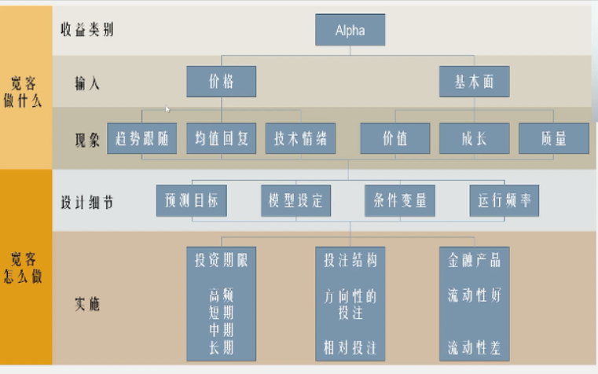

**《宽客人生》《原则》《威科夫操盘法》 《证券分析》**

**——关键时刻逆大众**

# 量化交易在中国

# 五大门派

## 五大门派的量化要素

- 财务数据会存在造假
- 技术指标也可能会造假
  - 主力故意做出形态吸引那些看图形的人进入
  - 进入不要紧,要及时跟着主力出来

# 有效市场假说

# 行为金融

- 有限理性、社会偏好、缺乏自控

- 拥有和没有拥有一件物品，对这个物品的看法是截然不同的
  - 买了的股票的一些不利的因素，在心理上被弱化了
- 更倾向于做短线投机
- 心理账户：辛苦赚的钱和中彩票的钱对待不一样
- 赚的股票倾向于卖，亏的股票指望翻红
- **截断亏损，让利润奔跑**

# 赚谁的钱？赚什么钱？

- 市场在某一特定时间内的无效性，或者说别人犯得错误
  - 价值投资者
- 主动承担某种特定的风险，继而获得承担该风险的风险溢价
  - 卖保险，小概率事件不发生躺着收钱，发生则赔付

> 主观投资和量化投资的区别:
>
> ​	只在于策略如何被制定以及如何被执行

- 庄家是美女,散户是屌丝
- 跟着庄家拉升赢5,砸盘赢1,做反亏3
- 整个A股市场1/3的时间是上涨

# **简单例子**

# 理工生的优势

​		**市场在不断进化,所以过去好的策略现在不一定是有效的,一个量化策略不是在简单的重复历史,而要考虑背后的动因,只有把握了市场演化的真正的规律才有可能通过这种逻辑的量化来赚取超额收益.而且一个策略被大多数人知道,那么这个策略很可能就会失效**

# 量化交易系统的基本架构

- 兴趣、热爱、深刻的理性思考
- 区间应该跨越牛熊周期

# 完整交易系统

