# 投资标的

1. 股票
   - A股、港股、美股及全球其他股票
2. 外汇
3. 债券
4. 期货
   - 股指期货
   - 商品期货
5. 期权

## 考虑因素

- 流动性
  - 滑点
  - 冲击成本
- 数据
  - 是否易获得
- 系统化方法

# 数据来源

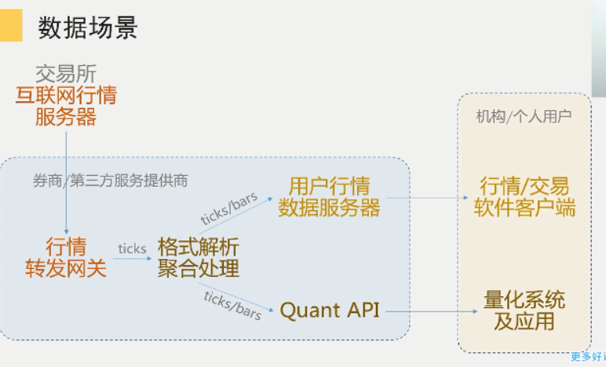

- 正确接收行情数据，并根据量化模型的需要累积出不同级别的分时和k线tick数据

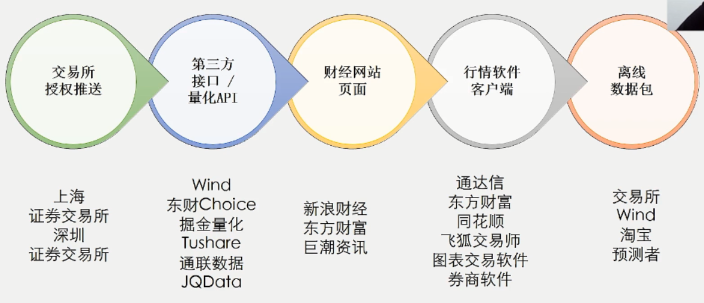

## Tick数据

- level1：
  - 股票一般间隔2,3秒 ； 期货半秒
  - 所以中间一些波动的信息是缺失的
- level2：
  - 完整的数据
  - 逐笔成交数据，每一笔的数据
- 明确一个行情数据接收和处理的概念，为今后搭建量化系统和进行策略开发打下基础
- 不同交易软件处理的分钟数据不完全一致？
  - 时间戳：有的左边有的右边11:29    11:30    11:31


# 理解各类技术指标

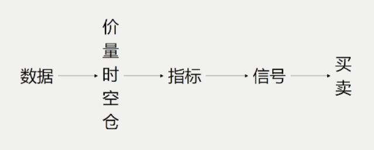

## 分类

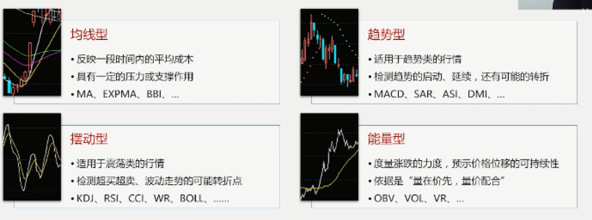


## python写MACD

```python
import pandas as pd

def calc_macd(close,long,short,mid):
    # the data type of "close" is pd.Series
    diff = close.ewm(span=short).mean()-close.ewm(span=long).mean()
    dea = diff.ewm(span=mid).mean()
    macd = (diff-dea)*2
    return (diff,dea,macd)
```

### 物理含义

- diff 可以理解为**加速度**

- diff在0轴上还是下:可以判断短期均线和长期均线的大小关系
- diff上涨:短期均线和长期均线在加速远离 , 近期行情在加速上涨
- 红柱缩短,动能减少,行情见顶,体现的是加速度的变化

## KD-随机指数

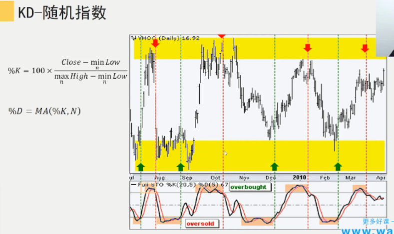

- 钝化 , 涨的越来越慢了

## RSI相对强弱指数

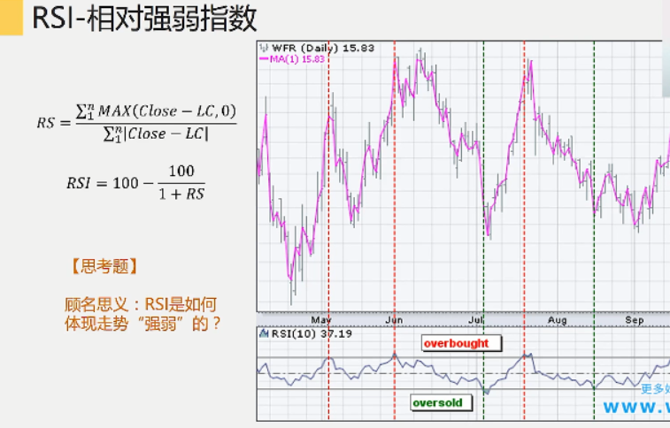

- 如果股票一直在涨,分子越来越大接近于1
- 如果股票一直跌,分子越来越小接近于0

## 背离信号检测(代码)

```python
def detect_divergences(self, p1, ind1, ind2):
    '''
    p1:价格序列
    ind1:diff
    ind2:dea
    '''
    instances = []
    # top_diverged
    anchors = self.cross(ind2, ind1) # 所有ind1下穿ind2的时间点
    barslast_dates = self.gen_barslast_dates(anchors) # 计算所有对应的前次下穿点
    barslast_prices = p1[pd.Index(barslast_dates)] # 提取前次下穿的价格序列
    barslast_prices.index = p1.index # 把前次下穿的价格序列和当前时间戳强制对齐
    barslast_indicators = ind1[pd.Index(barslast_dates)] # 提取前次下穿对应的ind1
    barslast_indicators.index = p1.index # 把前次下穿的ind1和当前时间戳强制对齐
    top_diverged_mask = anchors & \ 
    					(barslast_prices.shift(1) < barslast_prices) & \ 									(barslast_indicators.shift(1) > barslast_indicators) # 顶背离条件判断
    for tm in p1.index[top_diverged_mask]: # 记录所有检测到的顶背离信号
        instances.append({
            "time": tm,
            "signal": "top_diverged",
            “extra”: barslast_dates.shift(1).loc[tm] # 额外记录背离起点的信息
        })
    
```


## 应用技巧

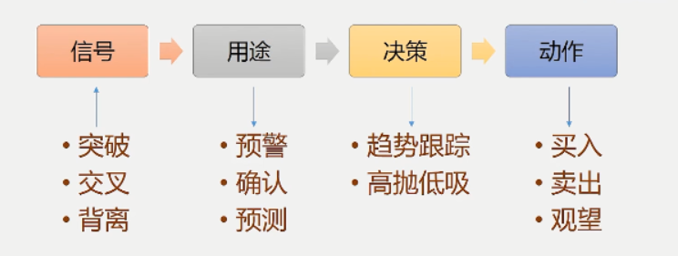

- 指标总会有延迟
- 多个指标判断


# 更多的交易决策依据

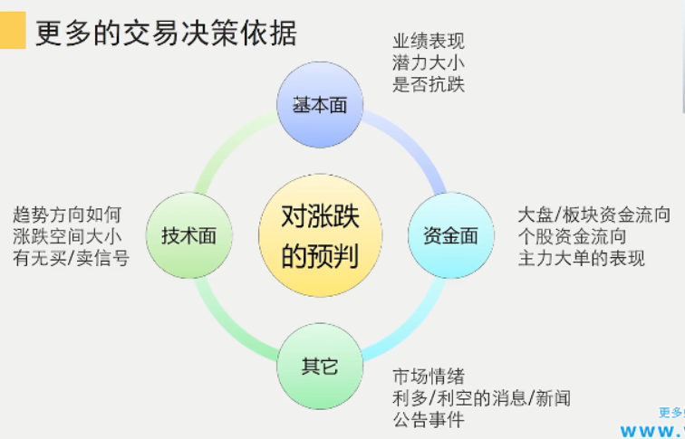

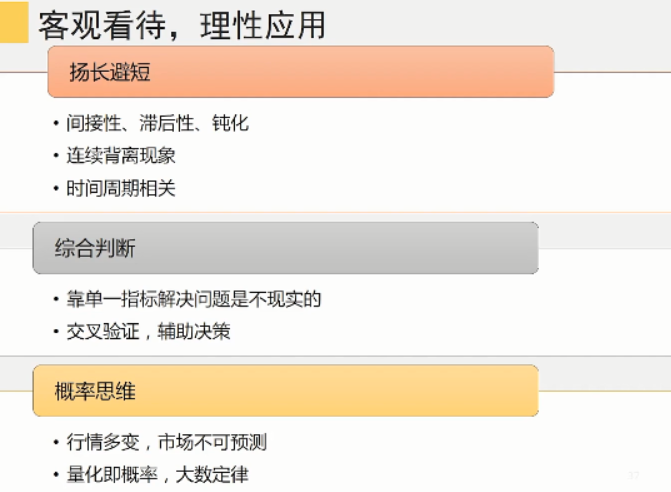

- 为什么只做一只股票?
- 为什么只测2年时间?
- 为什么每次都all in?
- 为什么没有加减仓管理?
- 什么时候叫停?
- 为什么没有止盈止损?

# 撮合规则

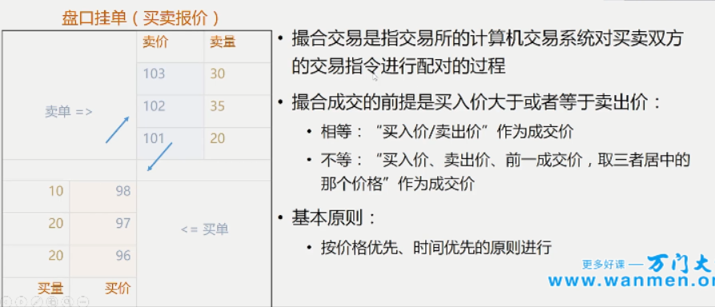

# 除权出息

- 前复权: 昨日:24 --> 8
- 后复权: 今日:8 --->24
- 动态复权

# 公告、研报和社交媒体

- 非结构化数据，自然语言处理

# ==趋势分析和量价分析==

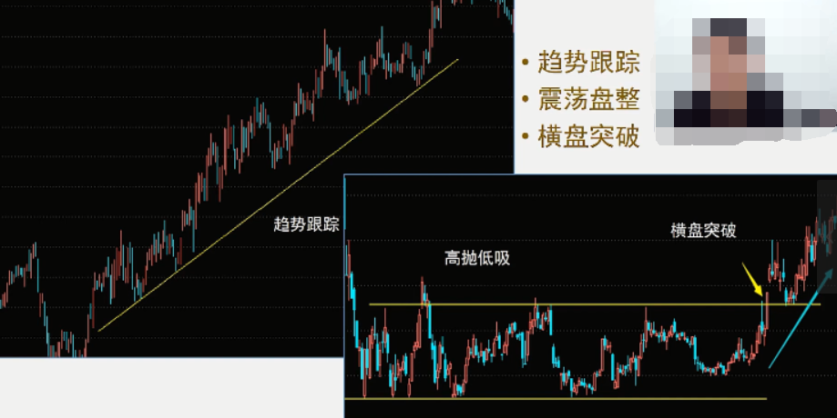

- 技术派量化的逻辑基础

- 行情：趋势+震荡

## 供需关系

- 趋势的动力来自于供需关系的不平衡

## 因果关系

- 趋势形成之前需要准备工程

## 努力和结果

- 成交量的增长没有使价格大幅增长，这是走势停止的行为
  - 明显的停止行为：
  - 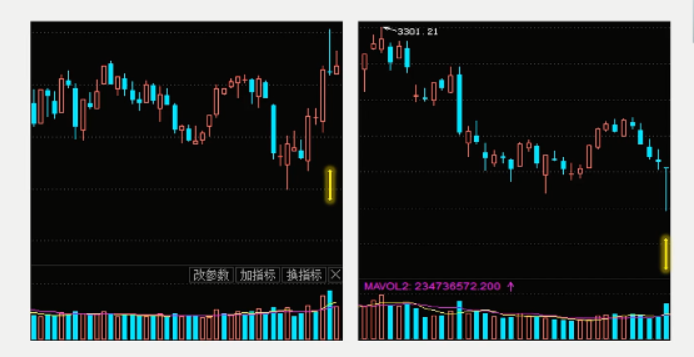

## 支撑

- 在某个价位购买力超过了抛售压力，需求吸收了全部供应
- 当价格再次回到支撑位，反弹力度表明需求质量

## 压力

- 某个价位抛售力量超过了购买力，供应超过了需求
- 当价格再次回到压力位，价格回落力度表明供应是否扩大