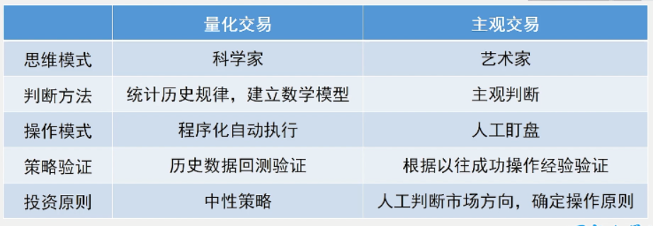

# 量化对冲与主观交易

- 量化：
  - 数据的准确性，逻辑的严谨性，细节的精确性
- 市场中性：
  - 收益来源于市场+自身
  - 市场是不稳定的
  - 股指期货不好对冲，有一定限制
- 暴露风险
  - 不遵循中性原则
  - 偏好某个行业，某种市场风格资金多分配权重，获得风险收益

==**一个量化系统不可能适应所有的市场风格，所有的时间。即一个量化系统不可能永远有效。**==

## 优劣

# 量化各个环节特点

## 量化目标

- 年化收益
- 夏普比率
- 最大回撤

### 策略风格

- 低风险低收益
- 中等风险中等收益
- 高风险高收益

## 头寸管理

- 仓位控制**至关重要**
- 规模
  - 最低要求（`50W`）
  - 流动性
    - 买不进来卖不出去
    - 一锤子涨停跌停
  - **一只股票的持仓量不要超过它流通市值的`2%`**
  - 当日买卖股票的成交量不要超过当天总成交量的`5%-10%`
- 中性
  - 中性原则
    - 资金投入不同的行业(金融、医药、酒类）和不同的风格（大盘股、小盘股）要尽量均衡
  - 分散度
    - 交易标的至少`15支`以上

## 风险控制

- 合理风险
  - 止盈止损的量化控制
  - 波动率指标
  - 执行风险

## 工作过程

- 试运行
  - 技术：验证整个系统在真实环境下的运行准确性、稳定性
  - 业务：验证交易策略在试运行期间是否严重偏离预期
- 正式运行
  - 尽量完全自动化执行，以避免操作风险
- 停止
- 监控
  - 技术监控（乌龙指事件，大盘瞬间跳动5个点）
    - 监控交易系统的运行正确性、稳定性
  - 业务监控
    - 监控**当前行情**是否使得量化策略失效

# 完整框架

## 选股

## 择时

## 风控

- 有了这套完整流程，适用于什么行情市场呢？
  - 高抛低吸策略不适用于牛市
  - 追涨杀跌策略不适用与震荡市
- **所以首先得判断现在是个什么行情**

# 过程解析

- 策略制定
  - 选股逻辑
  - 择时逻辑
  - 风险控制：止盈止损
  - 仓位控制
  - 成本控制
  - 回测验证

- 模拟盘实盘区别：
  - 模拟盘无法考虑冲击成本

# 策略实例

> 这是一个**趋势性策略** : 均线多头排列

1. 择时:

- 次日开盘买入

2. 行情判断
   - 震荡盘整vs明显趋势
   - 时间级别
   - 更多依赖经验和盘感

回测表现:

- 年化收益:16.58% 夏普:0.34 最大回撤:21%

# 人工干预

