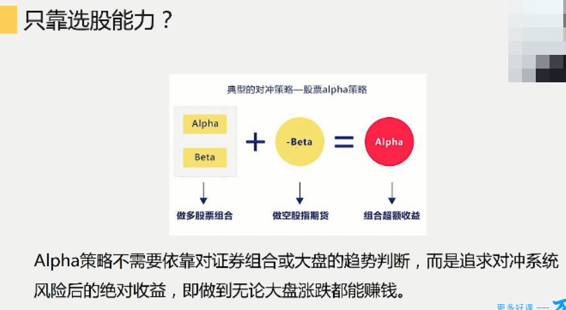

# 量化平台分类

# 交易系统

## ==与盈利相关的要素==

- 策略的胜率
  - 不一定要追求高胜率
  - 比如趋势型策略,追求的是高赔率,低胜率
- 每次交易的盈亏比(赔率)
- **头寸规模的确定**
  - 买多少呢?
  - 科学的办法: 风险控制头寸
- 资金量的大小
- 交易机会的多少
- 交易成本
  - 特别是短线应该考虑

# 量化对冲

- 你的收益 = $\beta$+ 主动选股择时带来的收益$\alpha$
- β部分风险大, 无法控制,所以要对冲

# 如何择时

- 股票池用信号变换慢的 : 基本面
- 择时用信号变换快的 :  技术指标

## 择时能力真的有效吗?

- 入场时机没出场时机重要

# 还缺什么?

- **头寸**
  - 根据**波动率**分配头寸
- **风控**
  - 策略内外的风控
- 止损
  - 波动率倍数设置止损
  - **如果亏了50% , 想让本金回来得盈利100%** , 付出的努力翻倍
- 退出
  - 回撤止盈
  - **跟踪窗口**
    - 

# 因子投资组合

# 单因子检验

## 零投资组合

# 海龟交易法则

**趋势型策略**

- 市场 : 高流动性
- 头寸规模 : 
  - 
  - 
- 入市策略
  - 
  - 系统1
    - `20`日均线突破的短期系统
    - 如果上次突破是盈利性突破,那么当前的入市信号被忽略
    - 如果上次突破是假突破 , 那么这次突破会入场
  - 系统2
    - `55`日均线突破的长期系统
- 加仓
  - 
  - 突破点建立`1`个单位(`20`手)头寸
  - 按N/2的价格间隔逐步扩大头寸
  - 直到头寸达到规模上限(`4`个`20`手)
- 止损
  - 任何一笔交易的风险程度不超过账户的`2%`
  - 价格变动的上限就是2N
  - 根据加仓情况,止损点上浮
- 退出
  - 系统1
    - 跌破`10`日均线
  - 系统2
    - 跌破`20`日均线
  - **退出不易,克服提早退出的冲动,坦然面对利润的蒸发**
- 其他细节完善
  - 流动性枯竭
  - 限价单vs市价单
  - 跳空
  - 跨市场选择
  - 合约滚动
- 趋势型策略典型收益分布
  - 

# 趋势vs震荡

- 趋势中有震荡,震荡中有趋势
- 取决于你的观察周期

# 均值回复型策略

# 缺口策略

- 买跳空低开的股票,一般会有一个上涨
- 