# 择时信号

## 买入

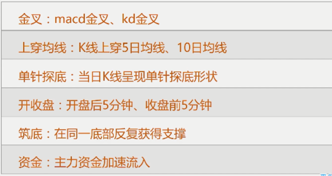

- 上穿过快会伴随回踩,看回踩的力度,踩稳就是比较好的信号

## 卖出

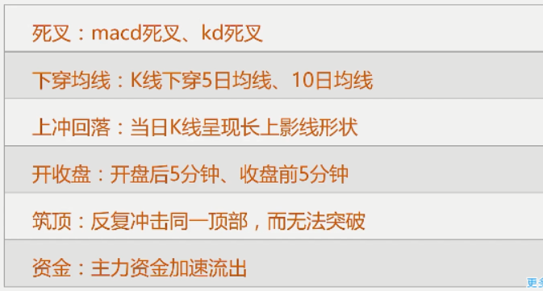

- 筑底:支撑线
- 筑顶:压力线
- 大量买盘进入,冲破压力线,马上转化成支撑线,大量买盘形成强支撑

# 止盈止损

## 平均波动率

- 用波动率衡量金融资产的风险
- 波动率的计算方法
  1. ATR
  2. 标准差

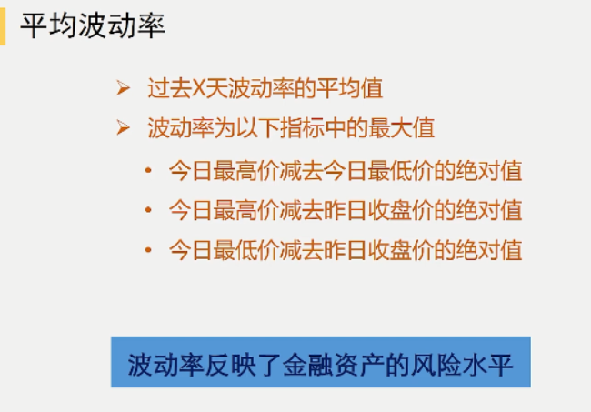

## 止盈方法

### 最大盈利

- 一笔交易期望获得的最大利润
- 例如:获利10%退出
- 设置为平均波动率的倍数
- 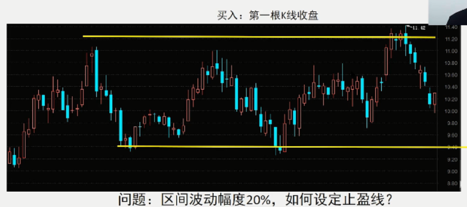

### 回撤止盈

- 最新高点的固定折回百分比
- 例如 : 获利20%以上回撤8%止盈
- 适合程序化进行
- 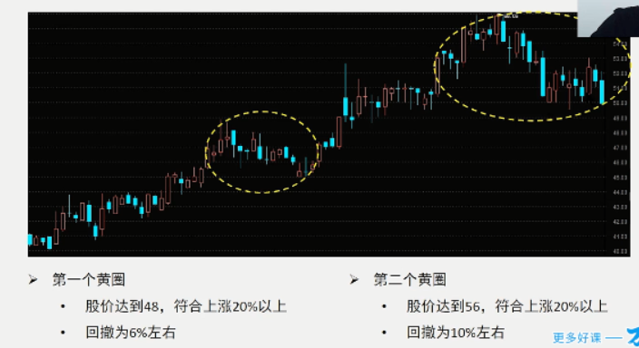

### 大幅波动

- 当市场出现不利于你的大幅波动时止盈
- 例如: 平均波动率为R,当出现2R时止盈
- 不能单独使用,需要保护性止盈

### 技术信号

- 均线交叉 , 停止信号作为止盈条件
- 例如: 5日下穿10日,20日均线
- 缺点 : 导致利润大幅回吐

## 止损方法

### 最大亏损

- 一笔交易愿意承担的最大损失
- 例如 : 亏损到5%止损
- 取值如果比较主观, 可能会错过反弹

### ==波动率倍数==

- 止损价设定为平均波动率的倍数
- 例如 : 平均波动率为R , 取止损值为3R
- 避免市场波动噪声
- 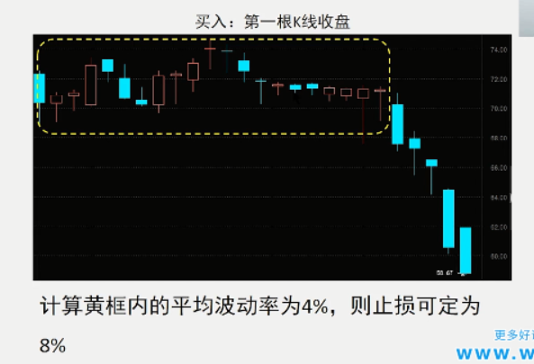

### 波动率标准差

- 止损价设定为波动率的标准差 , 可以捕获**异常波动**
- 例如 : 波动率的标准差为D ,止损价为2D
- 市场是非标准正态分布, 需要10%的修正

### 技术信号

- 跌破支撑线 , 死叉等
- 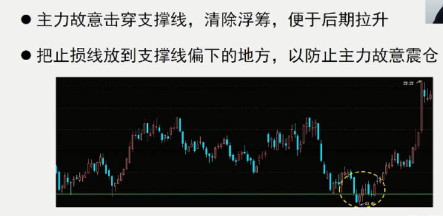

# 评价指标

## 年化收益

## 最大回撤

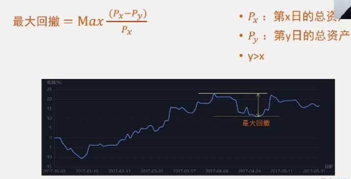

## 夏普比率

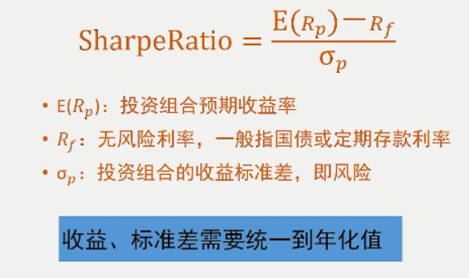

### 例子

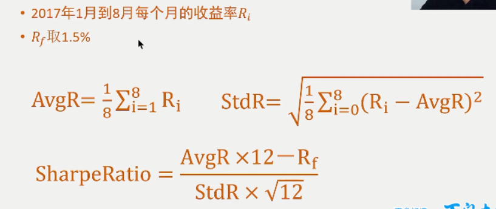

## 信息比率

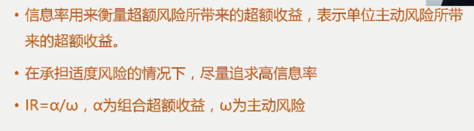

