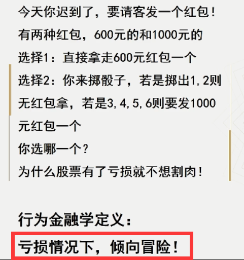

# 人类行为偏差

## 认知偏差

- 你所获得的信息是不完整的 , 但是你认为是完整的
- 勇于接受新的信息
- 我们日常所看到的所听到的 , 都是你自己想看到的想听到的

## 情绪偏差

- 只看到你想看到的, 忽视不想看到的

- 缺口跳空很难再上去的原因:
  - 心里止损线3% , 突然跳空跌了6% , 然后就不想卖了
  - 价格再次上来后赶紧抛出 , 导致价格上不去

# 避免与利用心理偏差

# 量化对冲

- 第一 : 保证每次交易的胜率高于`50%`
- 第二 : 保证有尽量多的交易次数
- 这样风险就小了很多
- 量化对冲就采取的这样的方式

## 怎么对冲?

