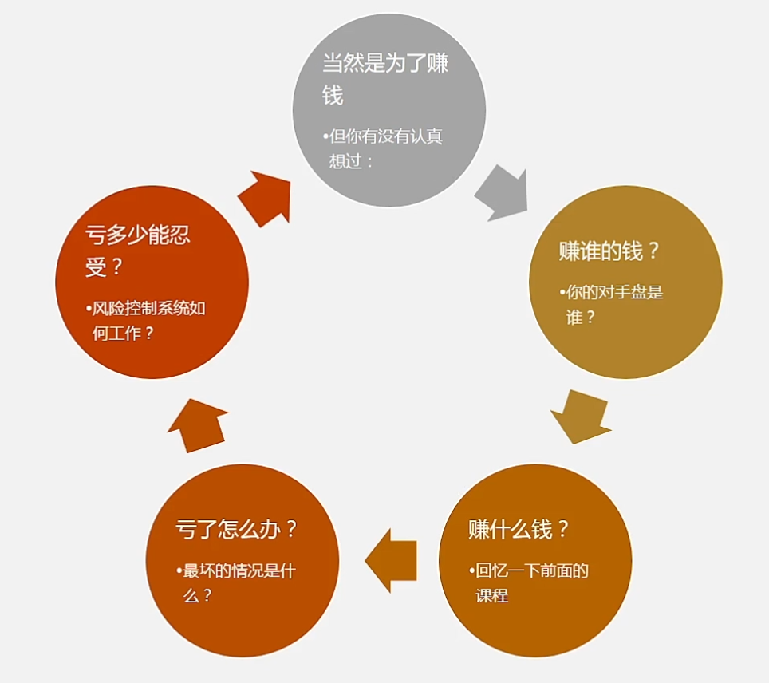
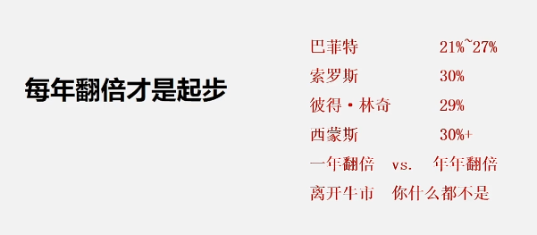
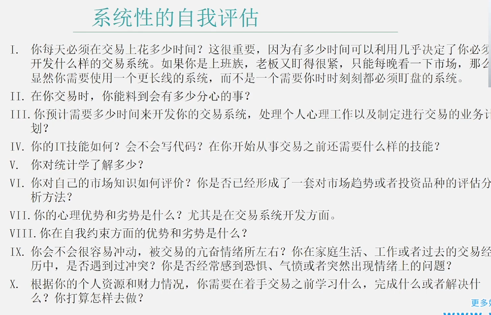
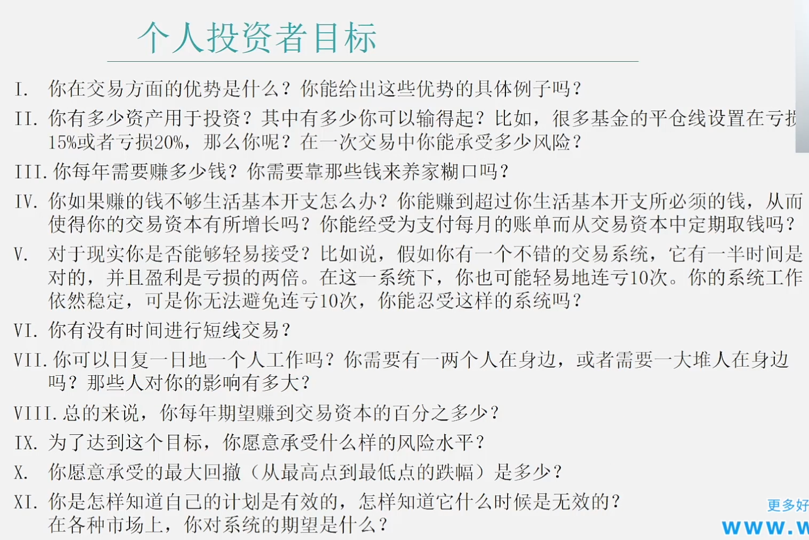
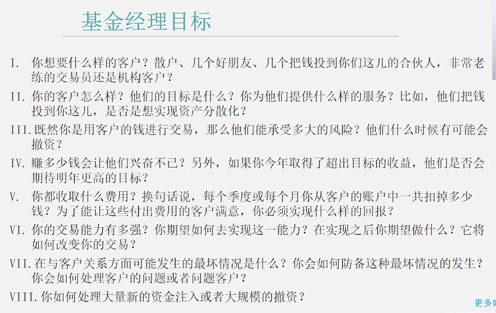
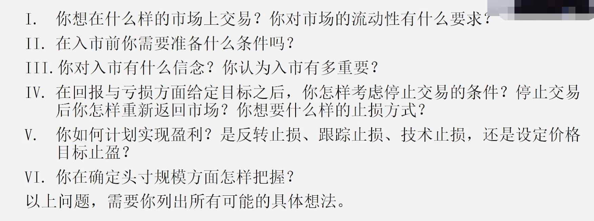
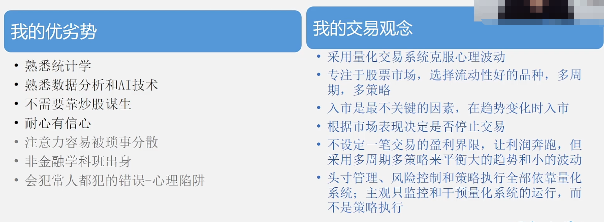
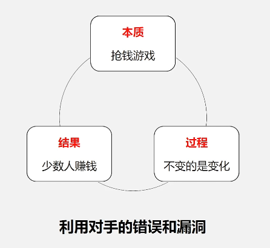
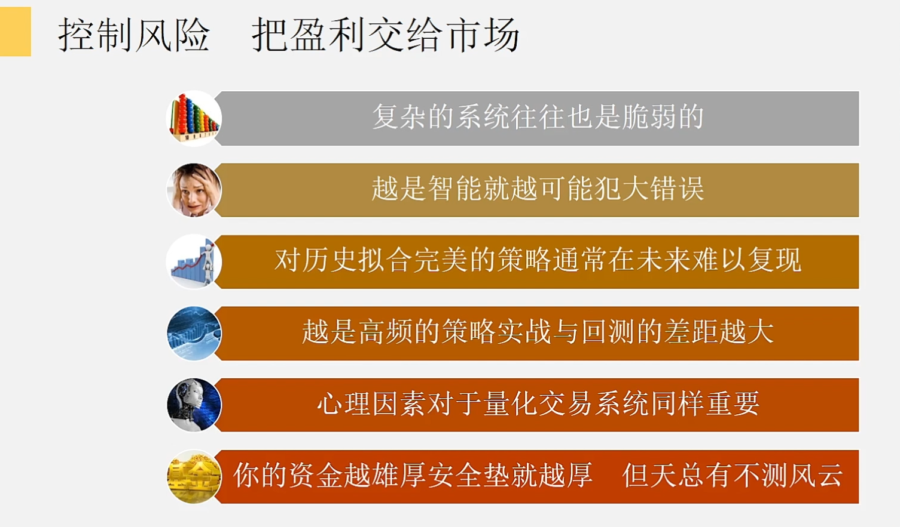

# 大类资产收益

# 目标

- 期望收益
- 允许最大回撤
- 时间多久

## 为什么入市

# 系统的自我评估

- 量化交易 , 核心是交易,不是量化,量化只是手段
- 对市场的理解最重要

# 个人投资者目标

# 基金经理

# 形成的交易观念

# 大佬现身说法

# 投资哲学

- 对手是谁?
  - 别人**最贪婪**的时候恐惧 , 别人**最恐惧**的时候贪婪

