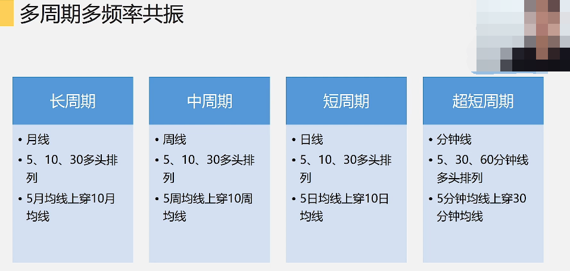
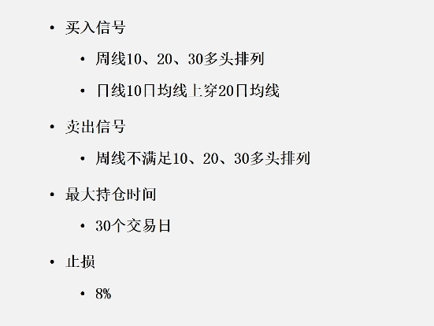
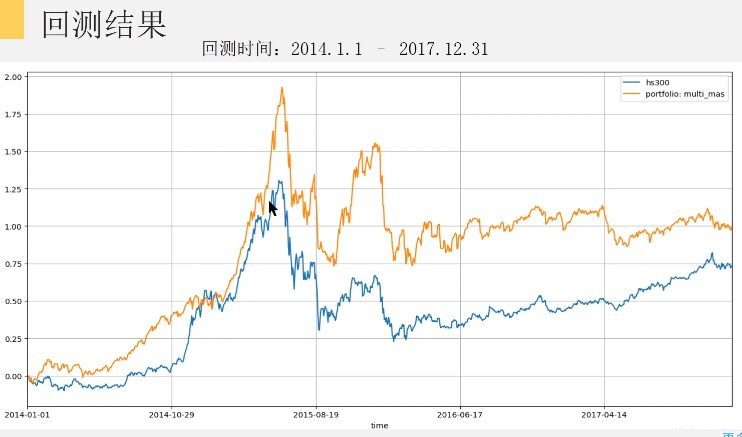

# 择时的意义

- 避免错判和漏判

- 对比阈值 , 查全率和精准率

# 多周期多频率

## 周期

- 时间跨度越大 , 信号越滞后 , 会导致很多漏判

- 多头排列的均线系统就是多周期

- 根据快线和慢线的走势和交叉来分析未来走势, 不仅考虑了当期所处的状态 , 也指出了当前状态变化的速度

## 频率

## 共振

## 周期和频率的关系

- 比如周内的日信息是没有的

# 策略实例

# 策略优化思路

- 最大回撤
  - 优化止损线
  - 波动率倍数止损
  - 优化退出信号
- 参数调整
  - 多头排列
    - 其他时间均线
    - 月线排列
  - 均线上穿
    - 其他均线上穿组合

**代码见PPT**